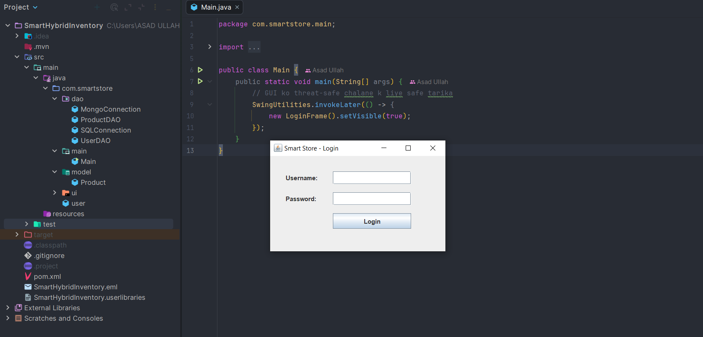
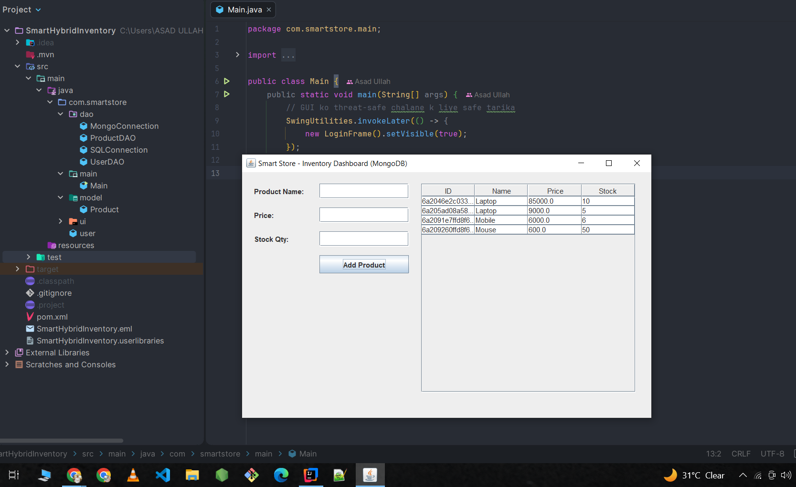

# 🛒 Smart Store - Hybrid Inventory & Customer Analytics System

A high-performance Java Desktop Application built using **Java Swing (GUI)** that demonstrates a **Hybrid Database Architecture** by seamlessly combining both Relational (SQL) and Non-Relational (NoSQL/MongoDB) databases.

---

## 🚀 Key Features

* **Secure Authentication (SQL):** Managed securely via MySQL using JDBC `PreparedStatement` to prevent SQL Injection attacks.
* **Dynamic Product Catalog (MongoDB):** Flexible product inventory schema allowing rich, dynamic product attributes (specs, configurations) leveraging MongoDB's NoSQL document capabilities.
* **Modern Swing GUI:** Clean, event-driven desktop interface utilizing Java Swing components and modern Java Lambda expressions.
* **Professional Layered Architecture:** Clear separation of concerns following the MVC/DAO pattern (`ui`, `model`, `dao`, `main` packages) for production-grade maintainability.

---

## 🛠️ Tech Stack & Dependencies

* **Language:** Java (JDK 26)
* **Frontend:** Java Swing / AWT
* **Databases:** MySQL (Relational), MongoDB (NoSQL)
* **Build Tool:** Maven
* **Core Libraries:** `mysql-connector-j`, `mongodb-driver-sync`, `bson`

---

## 📁 Project Architecture & Directory Structure

The project is structured following the standard professional **Layered Software Architecture**:

```text
src/main/java/com/smartstore/
├── main/       # Application Entry Point (Main.java)
├── ui/         # Swing GUI Views (LoginFrame.java, DashboardFrame.java)
├── model/      # Encapsulated Data Models (User.java, Product.java)
└── dao/        # Database Connections & Queries (SQLConnection.java, MongoConnection.java, ProductDAO.java)

```

---

## ⚙️ How to Setup and Run

### 1. Prerequisites

* Install Java JDK 17 or higher (Built using JDK 26)
* Install MySQL Server & MongoDB Community Server

### 2. Database Configuration

* **MySQL:** Create a database named `smart_store` and execute:
```sql
CREATE TABLE users (
    id INT AUTO_INCREMENT PRIMARY KEY, 
    username VARCHAR(50), 
    password VARCHAR(50), 
    role VARCHAR(20)
);
INSERT INTO users (username, password, role) VALUES ('admin', 'admin123', 'Admin');

```


* **MongoDB:** Create a local database named `smart_store_db` with a collection named `products`.

### 3. Build & Run

Clone the repository and run via your favorite IDE (IntelliJ IDEA) or using Maven:

```bash
git clone [https://github.com/asadullahdev5/Smart-Hybrid-Inventory-Customer-Analytics-System-.git](https://github.com/asadullahdev5/Smart-Hybrid-Inventory-Customer-Analytics-System-.git)
mvn clean install

```

---

## 📸 Application Preview

### Login Screen

*Secure role-based login system connected to MySQL.*

### Inventory Dashboard

*Dynamic inventory grid loaded directly from MongoDB collections.*

### Login Screen & Architecture


### Inventory Dashboard

